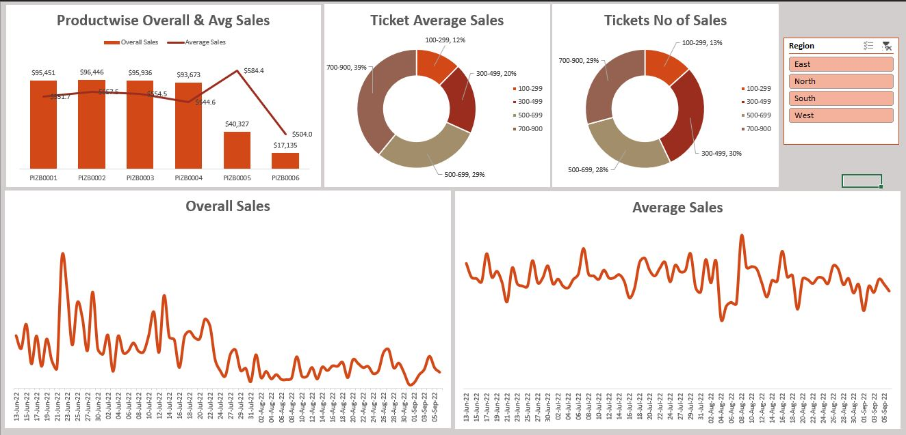

# Suplex Store Excel Analysis

Welcome to the Suplex Store Excel Analysis repository! Suplex Store is a fictional retail chain specializing in providing a wide range of products to its customers with a focus on quality and affordability. This project leverages Excel to analyze Suplex Store's sales data and uncover meaningful insights to support strategic decision-making.

---

## Dashboard

The analysis is supplemented by an interactive and insightful dashboard. This dashboard visualizes key metrics and trends, offering a clear understanding of the business performance.

### Dashboard Preview


---

## Business Questions Solved

This repository addresses the following business problems:

1. **Find the Overall Sales Value for Each Day**: What is the total sales value generated daily?
2. **Find the Average Sales Value for Each Day**: What is the average sales value per day?
3. **Create a Round-Off Value for the Sale Amount**: Round off sales amounts to the nearest 5 rupees and compare them with actual sales values.
4. **Sales Amount for Specific Buckets**: What are the sales amounts for the following buckets?
   - 300 to 500 rupees
   - 500 to 700 rupees
   - 700 to 900 rupees
   - 900 to 1100 rupees
   - 1100 to 1300 rupees
5. **Number of Sold Products for Specific Buckets**: How many products were sold in the above price buckets?
6. **Comparison of Each Product's Sales Value and Average Prices**: How do individual product sales values compare to their average prices?

By addressing these questions, this project provides a comprehensive understanding of Suplex Store's sales performance and highlights areas of opportunity for improvement.

---

## How to Use This Repository

1. Clone the repository to your local machine:
   ```bash
   git clone https://github.com/AyushAI/Suplex-Store-Excel-Analysis.git
   ```
2. Open the Excel file in your preferred spreadsheet software.
3. Explore the analysis and insights, and refer to the dashboard image for visual representations of key metrics.

---

## Folder Structure

```
Suplex-Store-Excel-Analysis/
├── Data/
│   ├── sales_data.xlsx
├── Dashboard_Image/
│   ├── Image.JPG
├── README.md
```

---

## License

This project is licensed under the MIT License. Feel free to use, modify, and share it as needed.

---

## Acknowledgments

Special thanks to the fictitious Suplex Store for inspiring this project.
